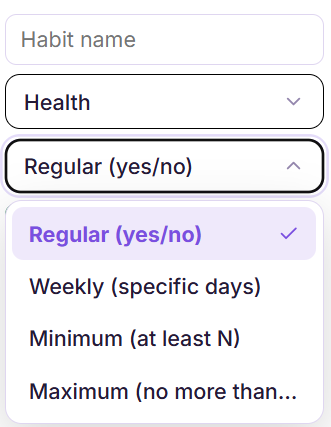
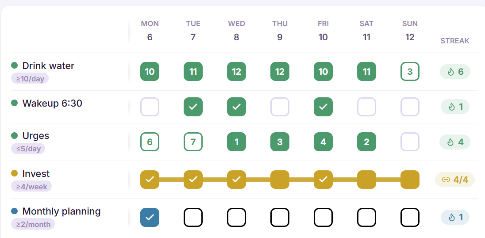
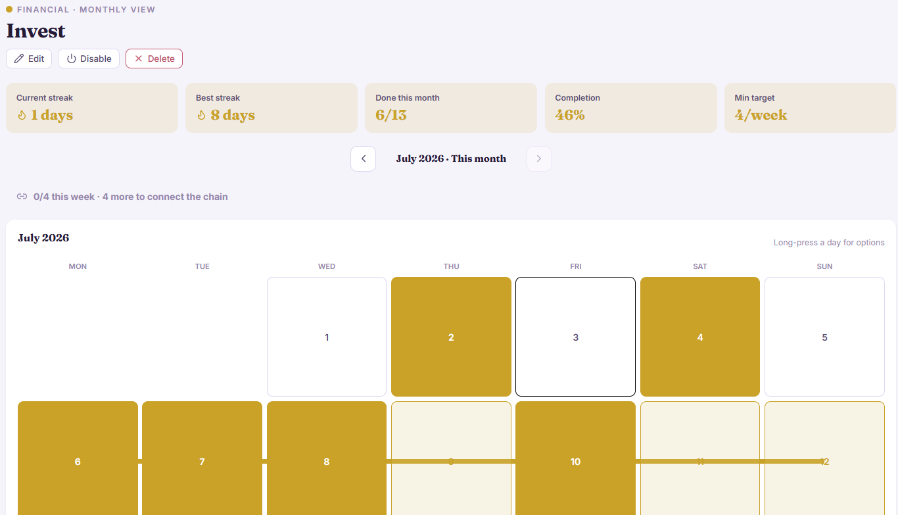

# Habits — Help

*Screenshot folder: `docs/help/screenshots/habits/` — see numbering convention in [README.md](README.md).*

## What it is

The Habits section is where you build (or break) a routine one day at a time.
Every habit you track shows up as a row of circles across the week — tap a
circle to mark it done. Over weeks, the pattern of filled and empty circles
*is* the story of who you're becoming: not a to-do list, but a mirror of your
consistency.

## How to use it

1. **Add a habit.** Click **+ New Habit**, give it a name and a pillar
   (Health, Focus, Mind, etc. — used to color-code and group it), then pick
   a type:
   - **Regular** — a simple daily yes/no habit (e.g. "Read 10 pages").
     Tap the circle for a day to mark it done.
   - **Weekly** — done on specific days of the week only (e.g. "Gym —
     Mon/Wed/Fri"). Only those days show as trackable.
   - **Minimum** — do it *at least* N times per day/week/month/year (e.g.
     "Drink water — at least 8x/day"). Tap repeatedly to log each count;
     the circle fills once you hit the target.
   - **Maximum** — a cap you're trying to *stay under* (e.g. "Screen time
     — no more than 3x/day"). Going over target flags the day instead of
     rewarding it — this type is for breaking habits, not building them.
   
2. **Log your day.** From the weekly grid, tap any circle for today (or a
   past day you forgot to log). For Minimum/Maximum habits, tapping opens a
   small counter — increment it as you repeat the action through the day.
   
3. **Set a minimum gap between logs** (optional, Minimum/Maximum + daily
   only). If you set "at least 30 min between logs," Anvil won't let you
   spam the counter to fake a streak — you have to actually wait and do the
   thing again. This exists to keep the number honest.
4. **Watch your streak and weekly/monthly % .** Each habit shows a flame
   streak (consecutive days/periods met) and the habit list's top bar shows
   Today / Week / Month completion rings across *all* habits combined, plus
   a 3-day comparison bar (today vs. yesterday vs. day before) so you can
   see at a glance whether you're trending up or sliding.
   
5. **Start-of-day setting.** If you're up past midnight, go to
   **Settings → General → Start of day** and set it to match when your day
   *actually* ends (e.g. 2 AM). Habits logged before that hour will still
   count toward the previous day, so a late night doesn't cost you a streak
   — or let you cheat one.

## Why it matters

A habit tracker is only useful if it changes what you *do*, not just what you
*record*. Anvil's Habits section is built around a few deliberate ideas:

- **Visible streaks create loss-aversion in your favor.** Once you have a
  14-day streak, skipping today doesn't just mean "no checkmark" — it means
  *breaking something you built*. That asymmetry is intentional; it's the
  single strongest lever behavioral science has for sustaining a new routine
  past the first two weeks, when motivation alone usually fails.
- **Minimum/Maximum types separate "build" from "break."** Building a habit
  (read more) and breaking one (scroll less) are psychologically different
  tasks — one rewards action, the other rewards restraint. Anvil models both
  explicitly instead of forcing everything into a single "did you do it"
  checkbox, so the tracker matches how the habit actually works in your life.
- **The gap timer stops you from gaming your own tracker.** It's tempting to
  tap "done" five times in one minute right before bed to hit a weekly
  minimum. The interval gate makes that impossible for gap-enabled habits,
  which protects the *meaning* of the streak — a 30-day streak should mean
  30 days of the real behavior, not 30 days of remembering to open the app.
- **The 3-day comparison and weekly/monthly rings are there to catch drift
  early.** Willpower doesn't fail all at once — it erodes over a few days
  first. Seeing "Today: 40%, Yesterday: 70%, Day before: 90%" as a downward
  bar is a much earlier warning than noticing a broken streak a week later,
  when the habit has already half-dissolved.

Used consistently, this section is meant to turn identity change ("I want to
be someone who exercises") into a visible, compounding record ("I have
exercised 47 of the last 50 days") — because the second sentence is what
actually rewires behavior, not the first.
